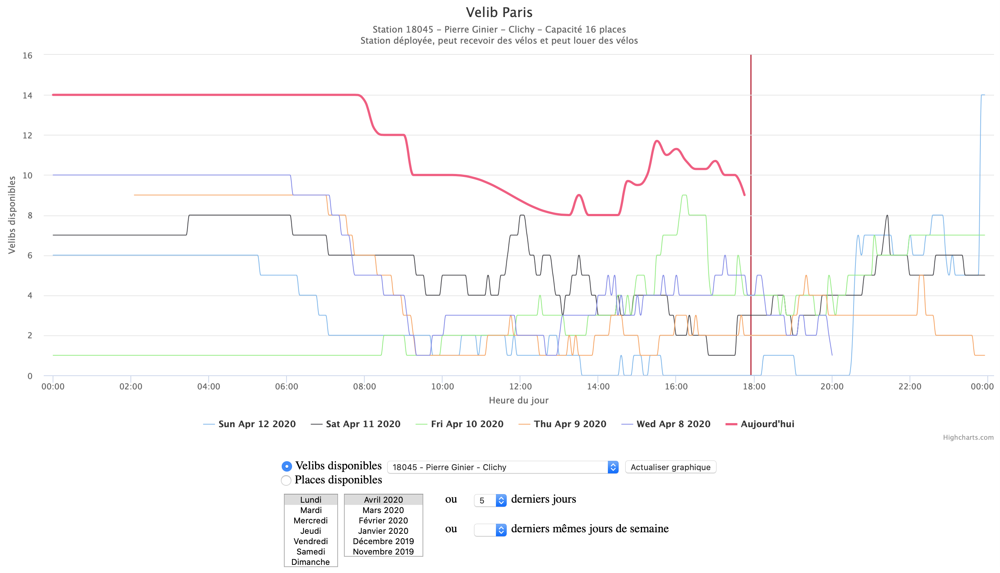

# Velib

## Installation on Raspberry PI
* sudo apt-get install nginx
* mkdir -p /home/pi/www/velib
* sudo apt-get install php7.0-fpm php7.0-mysql
* sudo apt-get install mysql-server phpmyadmin
* Secure MySQL & setup password
  * sudo mysql_secure_installation
* Force MariaDB to rely on passwords and not on system credentials: sudo mysql -h localhost -u root
  * mysql> use mysql;
  * mysql> update user set plugin='' where User='root';
  * mysql> flush privileges;
* ln -s /usr/share/phpmyadmin /home/pi/www/
* Setup database:
  * sudo mysql -h localhost -u root
  * mysql> CREATE DATABASE velib;
  * sudo mysql -u root -p velib < velib.sql

## Execution
* Schedule "php stations_info.php" once a day to update the station information
  * sudo crontab -e
  * 16 0 * * * /usr/bin/php /home/pi/www/velib/velib_scripts/stations_info.php >/dev/null 2>&1
* Schedule "php stations_usage.php" every 5 minutes to update the station usage
  * sudo crontab -e
  * */5 * * * * /usr/bin/php /home/pi/www/velib/velib_scripts/stations_usage.php >/dev/null 2>&1
* Open "index.php" on a PHP server to see the charts from your data

## Preview

